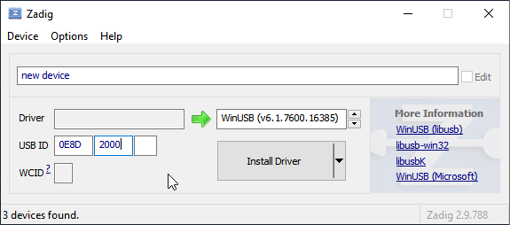

# MediaTek Flash Tool

Library and command line tool for interacting with the MediaTek bootloader, for
dumping and flashing firmware.

This is a fork of https://github.com/saleemrashid/mediatek_flash_tool with
modifications for MT8590 Walkmans - NW-A30/40/50, ZX300, WM1A, WM1Z, DMP-Z1.

## Dependencies

 * libusb >= 1.0.16 (Linux native build)

## Limitations

 * Only tested on MT8590, with Download Agent from SP Flash Tool
 * Only supports EMMC devices

## Features

 * Windows support (tested on Win10)
 * Supports auto-detecting device (requires hotplug capability in libusb)
 * Supports sending Download Agent to Preloader
 * Supports multiple dumping or flashing operations
 * Supports arbitrary address and length without scatter file
 * Supports rebooting the device after operations are completed
 * Enables USB 2.0 mode in Download Agent

## Building

See [BUILD.md](./BUILD.md)

### Using on Windows

If application fails with `Unable to detect MediaTek device: Operation not supported or unimplemented on this platform`
after connecting, you need to uninstall all related drivers and install libusb-compatible one:

1. Open PowerShell as admin
2. `pnputil /enum-drivers`
3. Look for your device (`VID_0E8D&PID_2000`), write down inf names (`oem<number>.inf`)
4. Remove driver packets: `pnputil -f -d oem<number>.inf`
5. (Just in case) Reboot
6. Create new driver with [Zadig][1]:
   1. Device -> Create New Device
   2. Enter VID and PID
   3. Driver: WinUSB (already set as default).



After that tool should be working.

## Examples

Dumping the GPT, using the appropriate Download Agent from [MTK_AllInOne_DA_5.2136.bin][2].

```bash
flash_tool -d MTK_AllInOne_DA_5.2136.bin -l 17408 -D GPT.bin
```

Assume the boot partition starts at 0x1d80000, with a length of 0x1000000.

Dumping the boot partition to `boot.bak`, flashing `boot.img` to the boot
partition, and rebooting.

```bash
flash_tool -d MTK_AllInOne_DA_5.2136.bin -R -a 0x1d80000 -l 0x1000000 -D boot.bak -F boot.img
```

Dumping the boot partition to `boot.bak`, patching it, flashing it back to the
boot partition, and rebooting.

```bash
flash_tool -d MTK_AllInOne_DA_5.2136.bin -a 0x1d80000 -l 0x1000000 -D boot.bak
./patch.sh boot.bak boot.img
flash_tool -2 -R -a 0x1d80000 -l 0x1000000 -F boot.img
```

[1]: https://zadig.akeo.ie/ 
[2]: https://github.com/bkerler/mtkclient/raw/refs/tags/1.9/mtkclient/Loader/MTK_AllInOne_DA_5.2136.bin